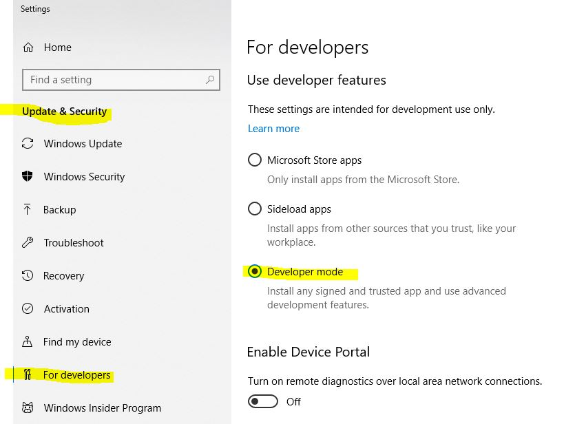

## What to bring
Just bring your laptop running Windows with Visual Studio 2017. You will need an Azure subscription to activate the Cognitive Services APIs, if you don’t have one please create one before the workshop. If you have your own Raspberry Pi and USB camera, please bring them, if not you can borrow one from us. 

### If you bring your own hardware
See the [complete hardware list here](hardware.md) and install the latest version of Windows IoT core.

### Bring a laptop running
- Windows 10 - Version	10.0.17134 Build 17134 (Or higher) (with Administrator access)
- Visual Studio 2017 -  (version 15.7.4) (with workloads: Universal Windows Platform development / Azure development)
- Latest UWP SDK (1803) [Installer - NL](https://developer.microsoft.com/nl-nl/windows/downloads/windows-10-sdk) /
[Installer - EN](https://developer.microsoft.com/en-us/windows/downloads/windows-10-sdk)
- Install the Windows IOT Core Dashboard [Download](http://go.microsoft.com/fwlink/?LinkID=708576)

### Others requirements
 - An Azure Subscription. [You can create one here](https://azure.microsoft.com/en-us/free/).
 - Some C# Knowledge *(it is not a copy / paste workshop)*
 - Headphones (with a mini jack)
 
## Enable development mode 
 - Open: settings
 - Open: Update & Security
 - Open: For Developers
 - Select: "Developer Mode" under "Use developer features"
 

## Note:
 - A remote desktop in Azure will **not work** as you need to access the local network
 - If you have a Mac, a Virtual Machine with the above requirement can work.

